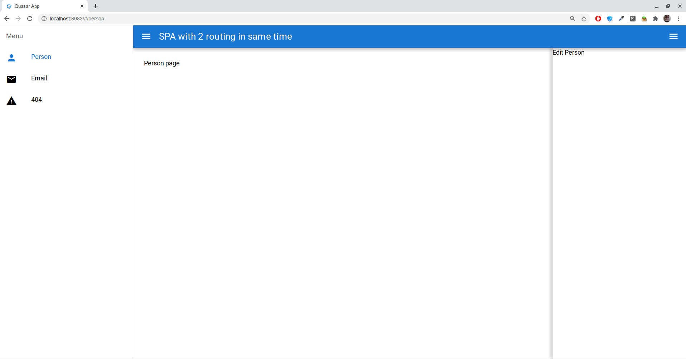

# Quasar App (quasar-router-demo)

A Quasar Framework app

## Install the dependencies
```bash
npm install
```

### Start the app in development mode (hot-code reloading, error reporting, etc.)
```bash
quasar dev
```

### Lint the files
```bash
npm run lint
```

### Build the app for production
```bash
quasar build
```

#### Demo


[](https://raw.githubusercontent.com/alexxsub/quasar-router-demo/master/src/demo.webm)


### Customize the configuration
See [Configuring quasar.conf.js](https://quasar.dev/quasar-cli/quasar-conf-js).
